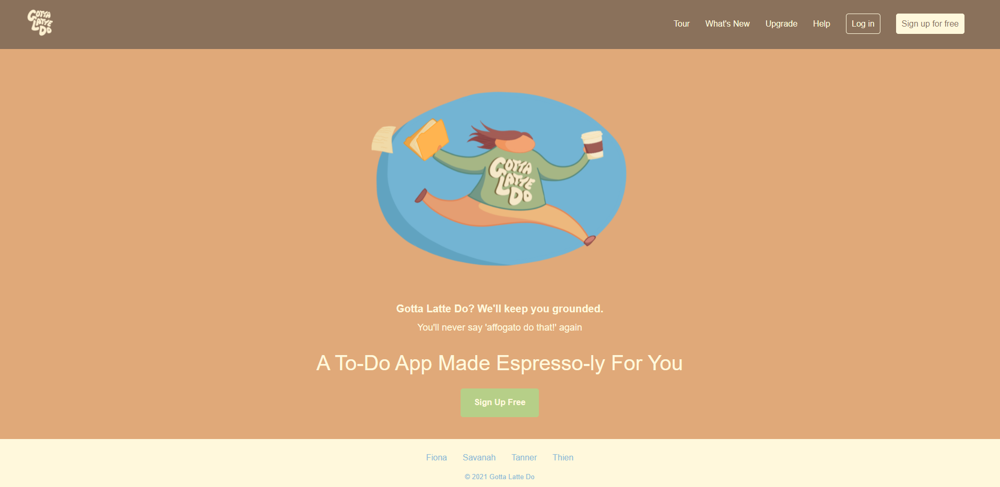
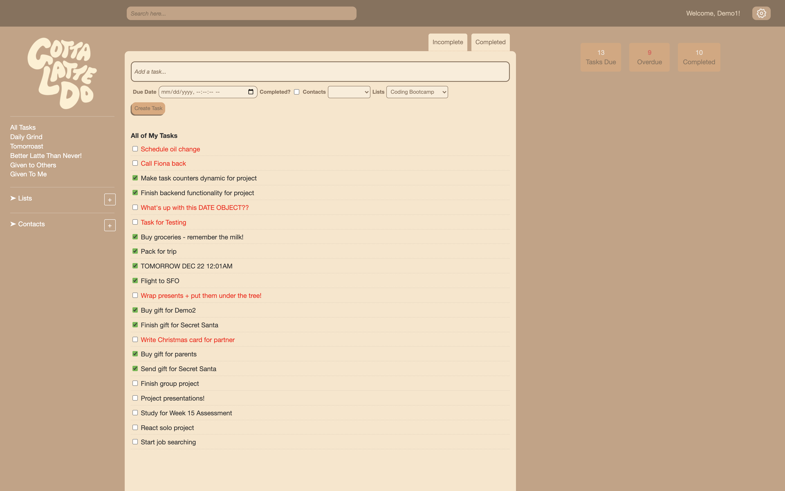
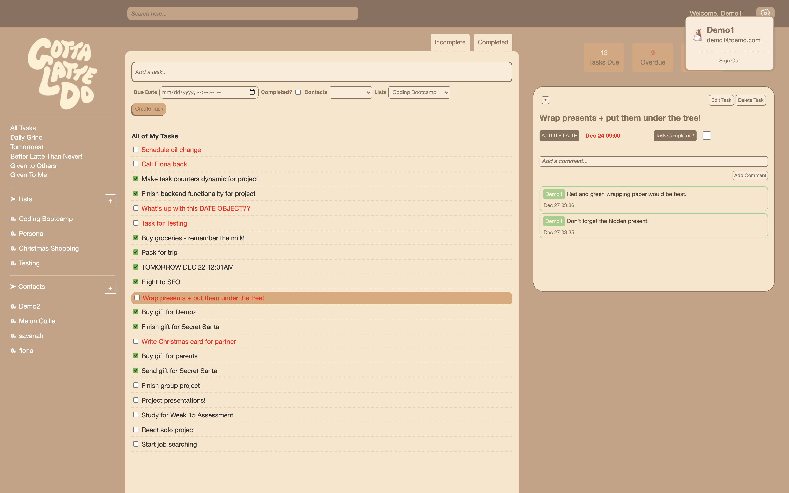
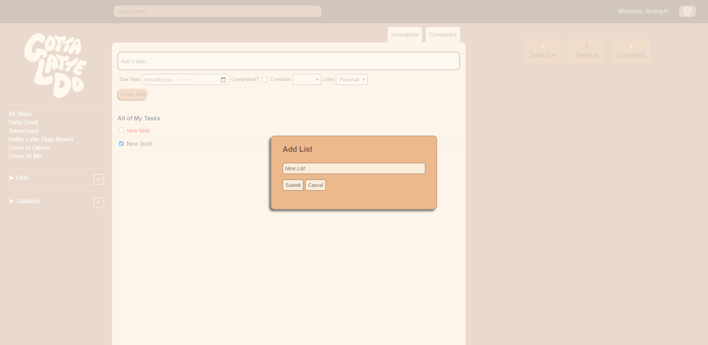
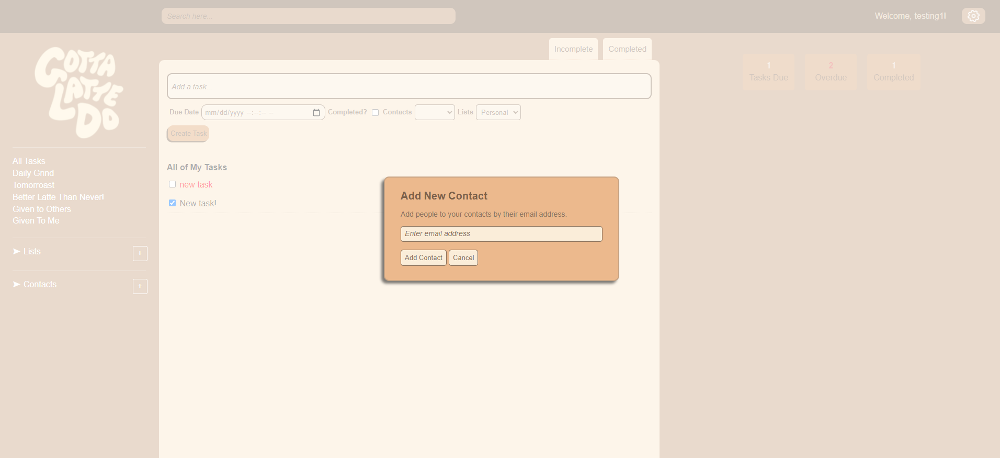
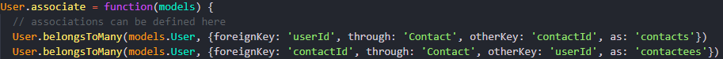
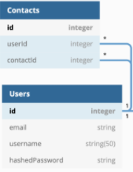
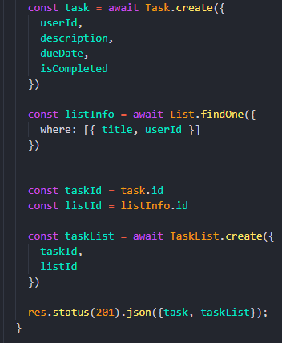
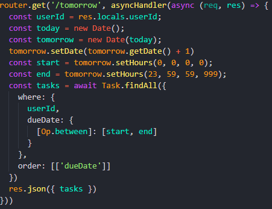
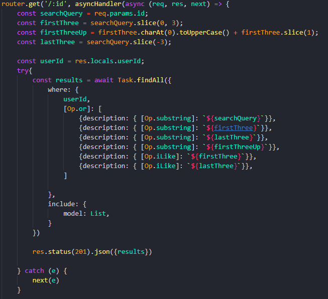

# Gotta Latte Do

Gotta Latte Do is a "smart to-do app" that organizes user tasks, and allows for interactivity on tasks between users. It is inspired by [Remember the Milk](https://www.rememberthemilk.com/).

Try making your own to-do lists at our live site: [Gotta Latte Do](https://gotta-latte-do.herokuapp.com/)

# Index
|
[MVP Feature List](https://github.com/strewm/Gotta-Latte-Do/wiki/MVP-Feature-List) |
[Database Schema](https://github.com/strewm/Gotta-Latte-Do/wiki/Database-Schema) |
[API Documentation](https://github.com/strewm/Gotta-Latte-Do/wiki/API-Documentation) |
[Frontend Routes](https://github.com/strewm/Gotta-Latte-Do/wiki/Frontend-Routes) |
[User Stories](https://github.com/strewm/Gotta-Latte-Do/wiki/User-Stories) |


# Technologies Used


# Getting started

1. Clone this repository

   ```git clone git@github.com:strewm/Gotta-Latte-Do.git```

2. Install dependencies

    ```npm install```

3.  Create a .env file based on the .env.example given

4.  Setup your username and database based on what you setup in your .env

5. Migrate and Seed models

    ```npx dotenv sequelize db:migrate``` &&
    ```npx dotenv sequelize db:seed:all```

6. Start the app using:

	```npm start```


7. You can use the Demo user or create an account


# Live

## Features

Gotta-Latte-Do is a completely dynamic website that allows logged-in users to add/edit/delete/get features from the home page without ever redirecting from the root.

Logged in users can:
 - Add/Edit/Delete Lists
 - Add/Edit/Delete Tasks
 - Add/Edit/Delete Comments on Tasks
 - Add/Delete Contacts
 - Give Tasks to Contacts
 - View Tasks by Category: All, Due Today, Due Tomorrow, Given to User by Contact, Given to Contact by User, Incomplete, Completed, and User-Created List Categories
 - Search for Tasks


### Welcome Page


### App Page


### Drop-downs + Pop-ups


### Modals




# To-do's/Future features

- User notifications when:
  - A task is coming due
  - Another user adds you as a contact
  - Another user assigns you a task
- User profiles
- Keyboard shortcuts


# Technical Implementation

 - One of our first challenges was associating User IDs to themselves so that Users can have Contacts:




 - In a similar vein, adding created lists to a join table for Lists with the proper Task and List IDs:




- The dreaded Date Object:




- Search bar functionality:


