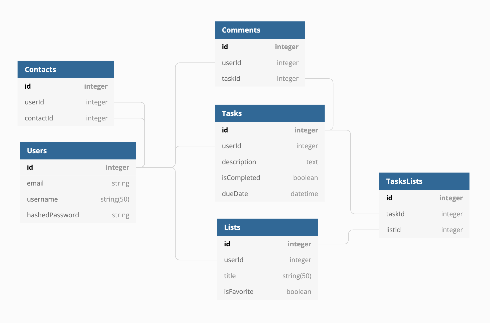

# Gotta Latte Do

Gotta Latte Do is a smart to-do app that organizes user tasks, and allows for interactivity on tasks between users. It was inspired by [Remember the Milk](https://www.rememberthemilk.com/).

Try making your own to-do lists at our live site: [Gotta Latte Do](https://gotta-latte-do.herokuapp.com/)

# Getting started

1. Clone this repository

   ```git clone git@github.com:strewm/Gotta-Latte-Do.git```

2. Install dependencies

    ```npm install```

3.  Create a .env file based on the .env.example given

4.  Setup your username and database based on what you setup in your .env

5. Migrate and Seed models

    ```npx dotenv sequelize db:migrate``` &&
    ```npx dotenv sequelize db:seed:all```

6. Start the app using:

	```npm start```

7. You can use the Demo user or create an account

# Database


